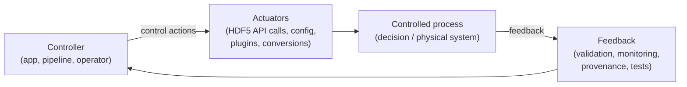

# HDF5 Safety Threat (Hazard) Model

## 1) Scope, assumptions, and non‑goals

### Scope

This model targets **how “HDF5 accidents” happen**, i.e., how non‑malicious (and sometimes malicious) triggers create **unsafe states** that lead to **losses** such as:

* data loss, corruption, silent wrong results
* file integrity loss (won’t open / opens incorrectly)
* privacy leakage via metadata, logs, artifacts
* cascading failures (one corrupted file poisons downstream pipelines)

It is **centered on the safety‑critical reality of an open HDF5 file**:

> An open HDF5 file is a **hybrid state**: some truth lives on disk, some in memory (metadata cache, chunk cache, free‑space manager), and some in-flight (VFD buffering, OS page cache, filesystem ordering).

Closed and read-only HDF5 are not immune from safety hazards, but this model is focused on open HDF5  files (that can be modified).

### Assumptions (explicit)

1. **Crashes happen**: process crash, `kill -9`, node reboot, power loss, out-of-memory (OOM) kill, abort due to assertion, segfault.
2. **Write ordering is not guaranteed** unless explicitly forced: OS + filesystem + storage can reorder and delay persistence.
3. **HDF5 uses caching and delayed writes** for performance, so “API returned success” does not automatically imply “durable on disk now” unless the API/documentation says so and the VFD/FS semantics cooperate.
4. **Extensions exist** (filters, VOL connectors, VFDs, plugins) and can execute code inside the process boundary.
5. Many real deployments include **parallel I/O, threads, or distributed workflows**, which increases timing/order hazards.

### Non‑goals (explicit)

* This is **not** a security threat model; it’s a **safety accident model** that can incorporate security/privacy threats when they create safety losses.
* This model does **not** assume the presence of a **write‑ahead log** (WAL) or transactional semantics in HDF5 today. (See [RFC: Write-Ahead Log](https://github.com/HDFGroup/hdf5doc/blob/master/RFCs/HDF5_Library/WriteAheadLog/RFC_WriteAheadLog.pdf).)
* This model does **not** prescribe a single solution (WAL, checksums, copy‑on‑write, journaling, etc.). It is meant to **systematically expose accident chains** and drive requirements/tests.
* This model does **not** attempt to prove correctness; it’s designed to produce **actionable artifacts** (hazard register, unsafe control action (UCA) list, constraints, tests).

## 2) Typical accident chain (the backbone)

We model an open HDF5 file as a distributed state machine spanning

* Disk-resident state
* In-memory state
* In-flight / semi-durable state

A typical **accident chain** looks like this:

> **Trigger → Unsafe State → Loss**

### Trigger (examples)

* crash/power loss mid‑write or mid‑flush
* I/O error, short write, disk full, network FS glitch
* memory corruption in-process (use-after-free (UAF)/out-of-bounds access (OOB), race, bit flip)
* malformed/unexpected input file (including adversarial)
* unsafe extension code executes in-process
* operational misuse (wrong sharing mode, wrong permissions, wrong lifecycle)

### Unsafe state (what makes the trigger harmful)

* on‑disk metadata becomes **inconsistent**
* in‑memory state diverges from on‑disk state with **no safe reconciliation**
* free‑space reuse or aliasing makes recovery/continuation **overwrite valid data**
* cache bookkeeping is corrupted (stale pointers, wrong sizes/addresses)
* extension boundary breaks invariants (writes unexpected bytes/offsets)
* sensitive metadata/artifacts become exposed

### Loss (what we care about)

* file won’t open; file opens but some contents are wrong
* silent data corruption (hardest class)
* lost updates (acknowledged but not durable)
* raw data overwritten due to metadata confusion
* privacy leak via metadata/logs/artifacts
* cascading failures in downstream tools/pipelines

This chain is intentionally generic so it can be applied to **each subsystem** (MDC, chunk cache, free space manager, B-tree/heap code, VFD, VOL, filters, etc.).

## 3) What are we protecting against?

Think “assets + safety properties.”

### Assets

* **File integrity**: HDF5 file remains parseable, consistent, and faithful to the format.
* **Data correctness**: reads return the data that was written (or the documented last-durable prefix).
* **Durability semantics**: what the user expects after `flush`/`close` is true on disk.
* **Availability**: file remains usable; recovery is possible; tooling doesn’t crash on open.
* **In-memory safety**: internal structures remain consistent; failures fail safe.
* **Privacy**: metadata and data are not leaked through side channels or artifacts.

### Safety properties (write these as “shall” constraints later)

* **Consistency**: on-disk metadata is internally consistent at defined safe points.
* **Ordering**: control actions that imply durability occur in a safe order.
* **Isolation**: extensions cannot violate core invariants silently.
* **Fail-safe behavior**: when invariants are violated, prefer *stop writing / refuse to proceed* over “continue and corrupt.”

## 4) Threat sources (who/what causes hazards)

Even for “accident” modeling, it helps to enumerate sources because mitigations differ.

### A) Unintentional / environmental

* application bugs (bad call ordering, misuse of flush/close semantics)
* concurrency hazards (threads, MPI, async I/O)
* resource exhaustion (disk full, memory pressure, file descriptor exhaustion)
* platform faults (power loss, reboot, kernel panic, filesystem bugs)
* storage behavior surprises (reordering, partial writes, weak flush semantics)

### B) Implementation defects (library + extensions)

* memory safety bugs (OOB/UAF/double free), integer overflow, undefined behavior (UB)
* missing input validation; inconsistent error handling
* logic bugs in free-space manager, cache eviction, address computations
* inadequate invariant checking prior to emitting durable bytes

### C) Adversarial / malicious (relevant because HDF5 is a supply-chain “carrier”)

* malformed HDF5 files crafted to crash or corrupt tools (parsers)
* plugin/filter/VOL hijacking (load attacker-controlled code)
* trojanized binaries, compromised dependencies
* data poisoning: maliciously modified HDF5 content for downstream ML/pipelines

## 5) Practical Systems-Theoretic Process Analysis (STPA)-style taxonomy

[STPA-style analysis](https://www.ul.com/sis/blog/introduction-to-stamp-stpa-and-cast) is powerful here because HDF5 is a **control system**: controllers (application/library/subsystems) issue control actions (write/flush/free/evict/load plugin), and unsafe actions under certain contexts produce hazards.

### 5.1 Controllers and controlled processes (reference structure)



#### Controllers

* Application code (user)
* HDF5 API layer (`H5F`/`H5D`/`H5G`…)
* Subsystems: metadata cache, free-space manager, chunk cache, object header/heap/B-tree managers
* Extension mechanisms: filters, VOL connectors, VFDs
* OS/filesystem/storage stack (implicit controller of persistence)

#### Controlled "processes"

* On-disk HDF5 state (metadata + raw data)
* In-memory state (caches, indices, bookkeeping)
* In-flight state (buffers, OS page cache, outstanding I/O)
* Artifacts (temp files, logs, plugin search paths)

#### Feedback

* return codes; error stack
* internal flags (dirty/clean, eviction pressure)
* “flush completed” signals (best-effort, depends on stack)
* file locking/sharing outcomes
* checksum/validation tool results (if any)

## 6) Hazard taxonomy (unsafe states)

A good hazard taxonomy is:

* **state-based** (describes unsafe condition)
* **subsystem-agnostic** (can apply anywhere)
* **mappable to SSP vulnerability categories** (later section)

### H0 — Safety baseline: “open-file hybrid state can diverge”

This is not a hazard itself; it’s the underlying reality.

### H1 — On-disk metadata inconsistency

The file’s durable metadata is not self-consistent (internal pointers, sizes, checks, graphs).

### H2 — Hybrid divergence without a safe reconciliation path

In-memory state and on-disk state disagree and the system lacks a reliable method to converge without loss/corruption.

### H3 — Unsafe ordering of durability-signaling actions

Operations imply durability (`flush`/`close` success), but the system allowed reorder/partial persistence that violates the implied contract.

### H4 — Free-space aliasing / reuse hazard

Freed regions are reused while older references can still “come back” (via partial updates, later repair, or tool behaviors), leading to overwrites.

### H5 — In-memory structural corruption hazard

Internal structures (cache entries, indices, lists, address maps) become corrupt, causing wrong writes, wrong reads, or unsafe frees.

### H6 — Parser ambiguity hazard

Ambiguity or underspecified format interpretation leads to multiple “valid” parses or inconsistent behavior across versions/tools.

### H7 — Extension boundary violation hazard

Extensions (filters/VOL/VFD/plugins) violate core invariants (write outside bounds, inconsistent metadata, unsafe callbacks), compromising safety.

### H8 — Operational exposure hazard

Misconfiguration of sharing, permissions, logging, deployment, or lifecycle exposes files to unintended modification or leaks.

### H9 — Privacy leakage hazard

Metadata, attributes, names, provenance-like structure, or embedded “metadata-as-data” leaks sensitive information.

### H10 — Supply-chain artifact hazard

Unsigned/unverified builds, compromised dependencies, plugin search path hijacking introduce unsafe code/data paths.

### H11 — Unknown/latent hazard

A placeholder category for discovered-in-audit hazards.

## 7) Unsafe Control Actions (UCA) taxonomy (STPA-style)

STPA UCAs fall into 4 classic types. Here’s a **practical mapping** for HDF5:

### UCA Types (generic)

1. **Not providing** a control action when needed
2. **Providing** a control action when not appropriate
3. **Wrong timing/order**
4. **Applied too long/too short** (stopped too soon, repeated too long)

### Control actions to analyze (for each subsystem)

Use these as your standard UCA checklist:

#### A. Emit durable bytes

* write metadata block
* write raw data block
* update free-space structures

#### B. Signal durability

* `flush` (per-object, per-file)
* `close` / finalize
* “commit” semantic (if any higher-level layer claims it)

#### C. Manage in-memory state

* mark dirty/clean
* evict cache entry
* reuse free-space segment
* rebuild indices / lazy load

#### D. Interpret external input

* parse superblock/object header/messages
* handle malformed/edge-case structures
* accept external metadata/value sizes

#### E. Execute extension code

* load plugin/filter/VOL/VFD
* call into extension
* accept extension-produced outputs

#### UCA examples

* **UCA‑A1 (Not provided):** fail to flush critical metadata before returning success on an operation that implies persistence.

* **UCA‑A2 (Provided when not appropriate):** reuse freed region while any stale reference may still exist (from partial updates or later tool repair).

* **UCA‑A3 (Wrong order):** update pointer/reference before target block is durable (or vice versa), leaving a dangling durable reference if a crash occurs.

* **UCA‑A4 (Too short):** partial write accepted without detection; internal state assumes full write.

* **UCA‑B1:** report “flush/close success” without ensuring required ordering/durability constraints are met.

* **UCA‑C1:** evict/overwrite an in-memory structure that is still the only consistent source of truth.

* **UCA‑D1:** accept ambiguous/malformed input that leads to divergent interpretations (tool A opens, tool B corrupts).

* **UCA‑E1:** load an extension from an untrusted location; or allow extension output to violate invariants without validation.

## 8) Threat taxonomy aligned with HDF5 SSP vulnerability categories

<table>
<thead>
<tr>
<th>Vulnarability category</th>
<th>What it looks like</th>
<th>Typical triggers</th>
<th>Common hazards</th>
<th>Common UCAs</th>
<th>Candidate mitigations</th>
</tr>
</thead>
<tbody>
<tr>
<td>(FMT) File Format-Level</td>
<td>
<ul>
<li>malformed file inputs crash tools or trigger unsafe behavior</li>
<li>ambiguous or weakly validated structures lead to silent wrong results</li>
<li>lack of integrity verification permits undetected corruption</li>
</ul>
</td>
<td>
<ul>
<li>corrupted file from crash, partial copy, network truncation</li>
<li>adversarially crafted file</li>
</ul>
</td>
<td>
<ul>
<li>H1 (on-disk inconsistency)</li>
<li>H6 (parser ambiguity)</li>
<li>H2 (divergence)</li>
</ul>
</td>
<td>
<ul>
<li>UCA‑D1: parser accepts malformed edge cases</li>
<li>UCA‑A3: wrong ordering causes durable dangling references</li>
</ul>
</td>
<td>
<ul>
<li>stronger validation, format hardening, checksums/integrity fields, canonicalization rules</li>
<li><b>WAL-style journaling</b> (as a mitigation concept) can reduce crash-induced metadata inconsistency by ensuring replayable safe points (but is not assumed in this model)</li>
</ul></td></tr><tr>
<td>(LIB) Library-Level</td>
<td>
<ul>
<li>memory safety bugs, races, UB create wrong writes/reads or crashes</li>
<li>unsafe defaults cause surprising persistence or sharing behavior</li>
</ul>
</td>
<td>
</td>
<td>
<ul>
<li>H5 (in-memory corruption)</li>
<li>H3 (durability signaling hazards)</li>
<li>H2 (divergence)</li>
</ul>
</td>
<td>
<ul>
<li>UCA‑C1: evict/overwrite internal state prematurely</li>
<li>UCA‑B1: claim durability incorrectly</li>
<li>UCA‑A4: accept partial write as complete</li>
</ul>
</td>
<td>
<ul>
<li>memory safety hardening, fuzzing, sanitizer CI, invariant checking before durable emission, concurrency discipline
</li></ul></td></tr><tr>
<td>(EXT) Extension-Level </td>
<td>
<ul>
<li>unsafe execution of unverified plugins</li>
<li>plugin hijacking or search-path substitution</li>
<li>extensions violate invariants or create covert channels</li>
</ul>
</td>
<td>
</td>
<td>
<ul>
<li>H7 (extension boundary violation)</li>
<li>H10 (supply chain via plugins)</li>
<li>H9 (privacy leak)</li>
</ul>
</td>
<td>
<ul>
<li>UCA‑E1: load extension from untrusted path</li>
<li>UCA‑E1’: accept extension outputs without validation against invariants</li>
</ul>
</td>
<td>
<ul>
<li>signature verification, allowlists/denylist policies, sandboxing/process isolation, strict boundary contracts + validation
</li></ul></td></tr><tr>
<td>(TCD) Toolchain and Dependency </td>
<td>
<ul>
<li>vulnerable third-party libraries (compression libs, parsers)</li>
<li>unpinned builds change semantics across releases</li>
<li>scripting interface flaws (Python/R/Matlab wrappers)</li>
</ul>
</td>
<td>
</td>
<td>
<ul>
<li>H10 (artifact hazard)</li>
<li>H5 (memory corruption via dependency)</li>
<li>H6 (behavior divergence)</li>
</ul>
</td>
<td>
<ul>
<li>UCA‑E1: link/load vulnerable dependency</li>
<li>UCA‑D1: wrappers accept unsafe inputs or expose unsafe defaults</li>
</ul>
</td>
<td>
<ul>
<li>SBOMs, dependency pinning, reproducible builds, vulnerability scanning, policy gating
</li></ul></td></tr><tr>
<td>(OPS) Operational and Usage-Level</td>
<td>
<ul>
<li>unsafe sharing modes lead to corruption in multi-writer contexts</li>
<li>logging leaks, missing access controls, weak permissions</li>
<li>users misunderstand `flush`/`close` semantics</li>
</ul>
</td>
<td>
</td>
<td>
<ul>
<li>H8 (operational exposure)</li>
<li>H3 (durability misunderstandings)</li>
<li>H2 (divergence)</li>
</ul>
</td>
<td>
<ul>
<li>UCA‑B1: operationally claim data is safe when it isn’t (workflow contract mismatch)</li>
<li>UCA‑A2: concurrent modification without controls</li>
</ul>
</td>
<td>
<ul>
<li>clear operational guidance, safe-by-default modes, file locking conventions, audit logging controls
</li>
</ul>
</td>
</tr>
</li></ul></td></tr><tr>
<td>(OPS) Operational and Usage-Level</td>
<td>
<ul>
<li>unsafe sharing modes lead to corruption in multi-writer contexts</li>
<li>logging leaks, missing access controls, weak permissions</li>
<li>users misunderstand `flush`/`close` semantics</li>
</ul>
</td>
<td>
</td>
<td>
<ul>
<li>H8 (operational exposure)</li>
<li>H3 (durability misunderstandings)</li>
<li>H2 (divergence)</li>
</ul>
</td>
<td>
<ul>
<li>UCA‑B1: operationally claim data is safe when it isn’t (workflow contract mismatch)</li>
<li>UCA‑A2: concurrent modification without controls</li>
</ul>
</td>
<td>
<ul>
<li>clear operational guidance, safe-by-default modes, file locking conventions, audit logging controls
</li></ul></td></tr><tr>
<td>(PRV) Privacy-Specific</td>
<td>
<ul>
<li>metadata leakage (names, attributes, structures)</li>
<li>insufficient anonymization</li>
<li>traceability across file systems / pipelines</li>
</ul>
</td>
<td>
</td>
<td>
<ul>
<li>H9 (privacy leakage)</li>
<li>H8 (operational exposure)</li>
</ul>
</td>
<td>
<ul>
<li>UCA‑B? (policy): store sensitive fields in cleartext without user awareness</li>
<li>UCA‑C? (lifecycle): leave artifacts/logs behind unintentionally</li>
</ul>
</td>
<td>
<ul>
<li>privacy threat review for metadata, redaction tooling, attribute policies, encryption-at-rest guidance, controlled logging
</li></ul></td></tr><tr>
<td>(SCD) Supply Chain and Distribution</td>
<td>
<ul>
<li>unsigned binaries, trojanized dependencies</li>
<li>compromised package repositories</li>
<li>malicious builds distributed to users</li>
</ul>
</td>
<td>
</td>
<td>
<ul>
<li>H10 (supply chain artifact hazard)</li>
<li>H7 (extension boundary)</li>
<li>H5 (memory corruption)</li>
</ul>
</td>
<td>
<ul>
<li>UCA‑E1: accept unverified binaries/plugins</li>
<li>UCA‑D? accept “trusted” artifacts without verification</li>
</ul>
</td>
<td>
<ul>
<li>signing, provenance, secure distribution, verification tooling, reproducible builds
</li></ul></td></tr><tr>
<td>(UNK) Unknown</td>
<td colspan=5>
keep UNK as a live bucket, but require each UNK item to be “promoted” to a concrete hazard category once understood.
</td>
<td>
</tr>
</tbody>
</table>

## 9) How to use this model in practice (artifacts + workflow)

### Artifacts (what you produce)

1. **Subsystem inventory** (per component)
   * state variables: disk, memory, in-flight
   * control actions: write/flush/evict/free/parse/load extension
2. **Control structure diagram** (even a simple box/arrow diagram)
   * controllers, controlled processes, feedback channels
3. **Hazard register** (template below)
4. **UCA list** per control action (mapped to hazards)
5. **Safety constraints** (“shall” statements) derived from UCAs
6. **Test matrix**
   * crash injection points (before/after key actions)
   * malformed input cases
   * concurrency interleavings
7. **Instrumentation plan**
   * counters/tracepoints for: flush calls, write ordering assumptions, reuse events, parse errors, invariant failures
8. **Release gate**
   * every high-severity hazard must have: constraint + test + monitoring signal

### Workflow (repeat per subsystem)

1. **Define subsystem boundary** (what state you own)
2. **List control actions** (emit durable bytes, signal durability, manage memory, parse input, execute extensions)
3. **Enumerate hazards** (unsafe states)
4. **Enumerate UCAs** using the 4 UCA types
5. **Derive safety constraints** (testable “shall” statements)
6. **Design mitigations**
   * prevention (validation, ordering constraints)
   * detection (checksums, invariants)
   * recovery (repair tools, safe-mode)
   * containment (isolation/sandboxing)
   * (*optionally cite WAL-like journaling as a mitigation for crash consistency hazards*)
7. **Create tests**
   * crash injection + reopen verification
   * fuzzing + differential behavior tests
   * concurrency stress tests
8. **Operationalize**
   * document expectations (flush/close semantics)
   * add metrics/logging with privacy review

## 10) Compact safety‑threat taxonomy tuned to HDF5 accidents

A compact classifier that works well in practice:

> **Threat = Trigger × Locus × Propagation × Loss × SSP Category**

### Trigger (T)

* crash/power loss, I/O error, malformed input, memory corruption, concurrency, extension execution, misconfiguration

### Locus (L)

* file format parser, metadata cache, free-space manager, chunk cache, object header/B-tree/heap, VFD/VOL, filter/plugin, OS/filesystem

### Propagation (P)

* **P0:** contained in memory (crash but no disk harm)
* **P1:** durable but detectable (checksum/invariant catches it)
* **P2:** durable and silent (worst)
* **P3:** propagates cross-file/pipeline (cascading)

### Loss (S)

* unopenable, silent wrong results, lost updates, overwrite, privacy leak, availability/cascade

### SSP Category (C)

* FMT, LIB, EXT, TCD, OPS, PRV, SCD, UNK

This makes incident reports and hazard entries comparable and searchable.

## 11) Hazard register template (copy/paste)

Use this as your canonical register. It’s designed to be “STPA-friendly” (hazard ↔ UCA ↔ constraint ↔ test evidence) and SSP-aligned.

```text
Hazard Register Entry Template (HDF5 Safety / Accidents)

ID:
Title:
Subsystem / Component:
SSP Category: (FMT | LIB | EXT | TCD | OPS | PRV | SCD | UNK)
Threat Source: (unintentional | environmental | implementation defect | adversarial | operational)
Trigger(s):
Unsafe State (Hazard): (state condition, not an event)
Accident Chain: Trigger → Unsafe State → Loss
Loss / Impact: (unopenable | silent corruption | lost updates | overwrite | privacy leak | cascade | other)
Severity: (Low/Med/High/Critical) + rationale
Likelihood: (Low/Med/High) + rationale
Detectability: (Easy/Moderate/Hard) + rationale

Unsafe Control Actions (UCAs):
- UCA type: (not provided | provided when unsafe | wrong timing/order | too long/too short)
- Control action:
- Context that makes it unsafe:

Safety Constraints (testable “shall” statements):
- SC-1:
- SC-2:

Mitigations:
- Prevention:
- Detection:
- Recovery/Containment:
- Notes (optional): mention WAL-like journaling as mitigation if relevant (not assumed)

Evidence / Verification:
- Tests (crash injection points, fuzz cases, concurrency tests):
- Static analysis / sanitizers:
- Runtime invariants / assertions:
- Monitoring / telemetry signals:

Owner:
Status: (Proposed | Accepted | Mitigating | Verified | Deferred)
Links: (issues, PRs, docs, incident reports)
```

## 12) Checklists (practical, subsystem-applicable)

### Checklist A — “Open-file hybrid state” review (core safety checklist)

For any subsystem, answer “yes/no”:

* **State accounting**
  * Do we have a clear list of in-memory state that can diverge from disk?
  * Do we know which operations make disk state inconsistent if interrupted?
* **Durability truth**
  * Which API calls imply durability? Are we sure the implementation + VFD + FS can uphold it?
  * Do we ever return success while durable state could still be inconsistent?
* **Ordering constraints**
  * Do we rely on write ordering implicitly anywhere?
  * Are there explicit barriers/flushes when order matters?
* **Invariant gates**
  * Do we validate addresses/lengths/types before writing durable bytes?
  * Do we fail safe on invariant failure (stop writing / return error)?
* **Recovery expectations**
  * After a crash, can a user/tool distinguish “possibly inconsistent” vs “known consistent”?
  * If not, do we at least fail closed (refuse to write further)?

### Checklist B — Crash consistency & partial persistence

* Have we identified **crash injection points** around:
  * metadata update
  * free-space update/reuse
  * index update (B-tree/heap)
  * flush/close boundary
* For each crash point, do we know the expected post-crash outcome?
  * openable?
  * last-durable prefix semantics?
  * detectable inconsistency?
* Do we have a “safe-mode open” behavior (read-only open, or strict validation) for suspicious files?
* **Optional mitigation note:** would WAL-like journaling, copy-on-write, or atomic checkpointing reduce the number of crash points that can yield durable inconsistency?

### Checklist C — File format parsing & ambiguity

* Do parsers reject malformed structures early and consistently?
* Are there ambiguous interpretations that differ across versions/tools?
* Are there size/offset calculations protected against overflow/underflow?
* Do we have differential tests (same file across versions/build options) to detect divergence?
* Do we fuzz:
  * superblock/object headers/messages
  * heap/B-tree structures
  * filters/encoded metadata messages?

### Checklist D — Extensions (filters/VOL/VFD/plugins)

* Do we have a **trust policy** for what code can be loaded?
* Is the plugin search path controllable, and can it be hijacked?
* Do we validate extension outputs against invariants before accepting them?
* Can extensions exfiltrate sensitive metadata through side channels or logs?
* Do we have a containment option (process isolation / sandboxing) for high-risk extensions?

### Checklist E — Privacy & artifacts

* What metadata fields might contain sensitive information (names, attributes, provenance-like structure)?
* Are logs safe by default (no sensitive dumps)?
* Are temporary artifacts (core dumps, debug traces, exported metadata) controlled?
* Do we provide guidance or tooling for redaction/anonymization?
